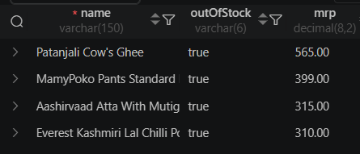
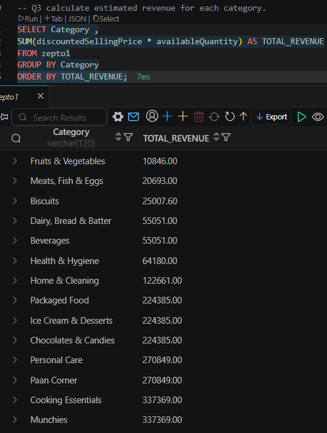
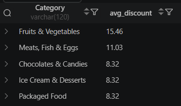

# 🛒 Zepto Inventory Analysis | SQL Project

**Turning 3,700+ raw inventory rows into pricing, stock, and revenue decisions — using nothing but SQL.**

Zepto is one of India's fastest-growing quick-commerce platforms, delivering groceries in minutes. Behind every "10-min delivery" promise is an inventory system juggling thousands of SKUs, fluctuating stock, and aggressive discounting. This project digs into that inventory data to answer the questions a category manager would actually ask: *What's driving revenue? What's sitting out of stock? Where are we discounting too much — or too little?*

---

## 📑 Table of Contents
- [Tools Used](#-tools-used)
- [Dataset](#-dataset)
- [Project Workflow](#-project-workflow)
- [Data Cleaning](#-data-cleaning)
- [Business Questions & Queries](#-business-questions--queries)
- [Key Insights](#-key-insights)
- [Challenges Faced](#-challenges-faced)
- [How to Run This Project](#-how-to-run-this-project)
- [What's Next](#-whats-next)
- [Let's Connect](#-lets-connect)

---

## 🛠 Tools Used

| Tool | Purpose |
|---|---|
| **MySQL** | Data cleaning, querying, business logic |
| **VS Code + SQLTools** | Query development environment |

---

## 📦 Dataset

| Detail | Value |
|---|---|
| Source | [Kaggle — Zepto Inventory Dataset](https://www.kaggle.com/datasets/palvinder2006/zepto-inventory-dataset) |
| Raw rows | 3,732 |
| Rows analyzed (after cleaning & deduplication) | 1,675 |
| Columns | 9 |
| Key fields | `name`, `Category`, `mrp`, `discountPercent`, `discountedSellingPrice`, `availableQuantity`, `weightInGms`, `outOfStock`, `quantity` |

---

## 🔄 Project Workflow

🔍 Explore  →  🧹 Clean  →  💡 Analyze  →  📊 Report

**1. Data Exploration** — row counts, null audits across all 9 columns, category listing, stock-status breakdown, duplicate SKU checks.

**2. Data Cleaning** — removed 1 invalid pricing record, fixed currency formatting, and deduplicated 1,187 products that were mistakenly tagged under multiple categories (see below).

**3. Business Insight Queries** — 8 SQL queries simulating real category-management questions, run against the cleaned dataset (`zepto_clean`).

---

## 🧹 Data Cleaning

| Issue | Fix |
|---|---|
| 1 row with `mrp = 0` (junk/incomplete entry) | Deleted |
| Prices stored in **paise**, not rupees | Divided `mrp` & `discountedSellingPrice` by 100 |
| 1,187 products tagged under multiple categories (duplicate rows) | Deduplicated — kept one row per product in a new `zepto_clean` table |

```sql
-- Remove invalid pricing rows
DELETE FROM zepto1
WHERE mrp = 0;

-- Convert paise → rupees
UPDATE zepto1
SET mrp = mrp/100.0,
    discountedSellingPrice = discountedSellingPrice/100.0;
```

### Duplicate Category Investigation

While reviewing early results, several category pairs showed suspiciously identical revenue totals (e.g., Packaged Food, Ice Cream & Desserts, and Chocolates & Candies all returned the exact same figure). Investigating further revealed the root cause: many products were duplicated across multiple category labels in the source data.

```sql
-- Identify products tagged under multiple categories
SELECT name, COUNT(DISTINCT Category) AS category_count
FROM zepto1
GROUP BY name
HAVING category_count > 1
ORDER BY category_count DESC;

-- Create a deduplicated table, keeping one row per product
CREATE TABLE zepto_clean AS
SELECT *
FROM (
    SELECT *,
           ROW_NUMBER() OVER (PARTITION BY name ORDER BY Category) AS rn
    FROM zepto1
) ranked
WHERE rn = 1;
```

This reduced the dataset from 3,731 rows (post pricing-cleanup) to **1,675 rows**, and category count from 14 down to **9** genuinely distinct categories. All business queries below were re-run on `zepto_clean` to ensure accurate, non-inflated figures.

---

## 💡 Business Questions & Queries

<details>
<summary><b>Q1. Which products offer the best discount-based value?</b></summary>

```sql
SELECT DISTINCT name, mrp, discountPercent
FROM zepto_clean
ORDER BY discountPercent DESC
LIMIT 10;
```
**Finding:** Biscuit/wafer brands (Dukes Waffy) and ready-to-cook kits (Ceres Foods) dominate the top 10 — all sitting at a steep 50–51% off.
</details>

<details>
<summary><b>Q2. Which high-value products are out of stock?</b></summary>

```sql
SELECT DISTINCT name, outOfStock, mrp
FROM zepto_clean
WHERE outOfStock = 'true' AND mrp > 300
ORDER BY mrp DESC;
```
**Finding:** Everyday staples — Patanjali Cow's Ghee (₹565), MamyPoko Pants (₹399), Aashirvaad Atta (₹315), Everest Kashmiri Lal Chilli Powder (₹310) — were all out of stock despite high price points. These are exactly the SKUs that shouldn't be unavailable.
</details>



<details>
<summary><b>Q3. Which categories generate the most estimated revenue?</b></summary>

```sql
SELECT Category,
       SUM(discountedSellingPrice * availableQuantity) AS TOTAL_REVENUE
FROM zepto_clean
GROUP BY Category
ORDER BY TOTAL_REVENUE DESC;
```
**Finding:** Cooking Essentials leads with an estimated ₹2,83,472 in revenue, followed by Paan Corner (₹2,22,777) and Chocolates & Candies (₹2,02,772). Fruits & Vegetables came in lowest (₹10,378) — fresh produce moves fast but contributes far less to revenue than packaged goods.
</details>



<details>
<summary><b>Q4. Where is the platform under-discounting on premium items?</b></summary>

```sql
SELECT DISTINCT name, mrp, discountPercent
FROM zepto_clean
WHERE mrp > 500 AND discountPercent < 10
ORDER BY mrp DESC, discountPercent DESC;
```
**Finding:** A clear segment of premium-priced products (MRP > ₹500) carries minimal discounting (<10%) — these are likely positioned as non-promotional, everyday-essential SKUs.
</details>

<details>
<summary><b>Q5. Which categories discount the most, on average?</b></summary>

```sql
SELECT Category, ROUND(AVG(discountPercent), 2) AS avg_discount
FROM zepto_clean
GROUP BY Category
ORDER BY avg_discount DESC
LIMIT 5;
```
**Finding:** Fruits & Vegetables (15.93%) and Meats, Fish & Eggs (9.91%) lead in average discount — perishables get discounted hardest, likely to clear stock before spoilage.
</details>



<details>
<summary><b>Q6. Which products offer the best price-per-gram value?</b></summary>

```sql
SELECT DISTINCT name, weightInGms, discountedSellingPrice,
       ROUND(discountedSellingPrice/weightInGms, 2) AS price_per_gram
FROM zepto_clean
WHERE weightInGms >= 100
ORDER BY price_per_gram;
```
**Finding:** Surfaces the true "value for money" leaders — useful for building a "Best Value" badge/filter feature.
</details>

<details>
<summary><b>Q7. How can products be grouped by pack size?</b></summary>

```sql
SELECT DISTINCT name, weightInGms,
CASE
    WHEN weightInGms < 1000 THEN 'low'
    WHEN weightInGms < 5000 THEN 'medium'
    ELSE 'bulk'
END AS weight_category
FROM zepto_clean;
```
**Finding:** Segments inventory into Low/Medium/Bulk pack sizes — a foundation for size-based recommendation logic.
</details>

<details>
<summary><b>Q8. What's the total inventory weight carried per category?</b></summary>

```sql
SELECT Category, SUM(weightInGms * availableQuantity) AS total_inventory
FROM zepto_clean
GROUP BY Category
ORDER BY total_inventory DESC;
```
**Finding:** Highlights which categories are warehouse/logistics-heavy — important for delivery-time and storage planning in quick-commerce.
</details>

---

## 🔑 Key Insights

> 🏆 **Cooking Essentials** is Zepto's revenue powerhouse, generating an estimated **₹2,83,472**
> — nearly 27x the revenue of Fruits & Vegetables.

> 🥦 **Perishables get discounted hardest.** Fruits & Vegetables (15.93% avg) and Meats, Fish & Eggs (9.91% avg) top the discount charts
> — a classic "sell it before it spoils" pricing strategy.

> 📉 **Stockouts are hitting high-value staples.** Ghee, atta, and chilli powder
> — daily essentials, not impulse buys
> — were found out of stock at premium price points, a likely source of lost revenue.

> 🔍 **Caught and fixed a data quality issue.** Initial revenue queries showed identical totals across seemingly unrelated categories (e.g., Packaged Food, Ice Cream & Desserts, and Chocolates & Candies). Investigation revealed 1,187 products were duplicated across multiple category tags in the source data. After deduplication, the dataset shrank from 3,731 to 1,675 rows, and all revenue figures were recalculated for accuracy.

---

## 🧩 Challenges Faced

**Boolean import errors:** MySQL rejected `outOfStock` as a true boolean type during CSV import.
**Fix:** Imported the column as `VARCHAR` and used string-based filtering (`outOfStock = 'true'`) instead — a practical workaround that kept the analysis moving without losing data integrity.

**Hidden duplicate-category bug:** Early revenue queries returned suspiciously identical totals for unrelated categories. Tracing the issue back to 1,187 duplicate-tagged products required writing diagnostic queries before trusting any business conclusion — a reminder that surprising results in SQL are usually a data signal, not a fluke.

---

## ▶️ How to Run This Project

1. Clone this repo
2. Import the dataset into MySQL as table `zepto1`
3. Open `zepto_sql_project.sql` in VS Code (SQLTools) or any MySQL client
4. Run queries top to bottom: Exploration → Cleaning → Deduplication (`zepto_clean`) → Business Insights

---

## 🚀 What's Next

- [ ] Build a Power BI dashboard on top of these findings
- [ ] Trace the duplicate-category issue back to the original Kaggle source to understand its root cause
- [ ] Automate the cleaning + deduplication steps into a reusable script

---

## 🤝 Let's Connect

📌 **GitHub:** [SunainaSingh56](https://github.com/SunainaSingh56)
📌 **LinkedIn:** [Sunaina Singh](https://www.linkedin.com/in/sunainasingh56)

*If you found this useful, a ⭐ on the repo is always appreciated!*
