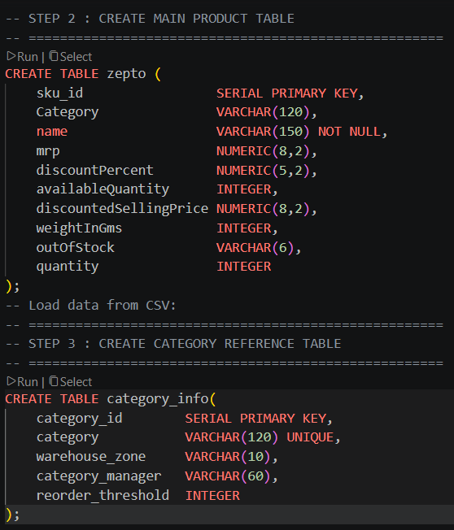
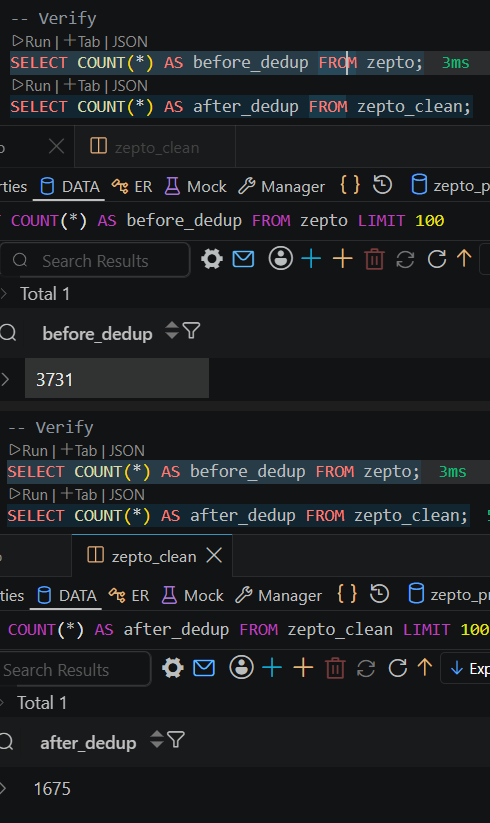
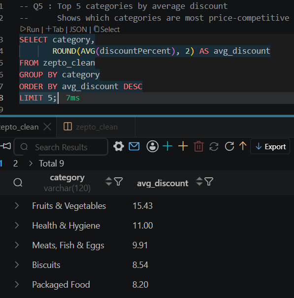
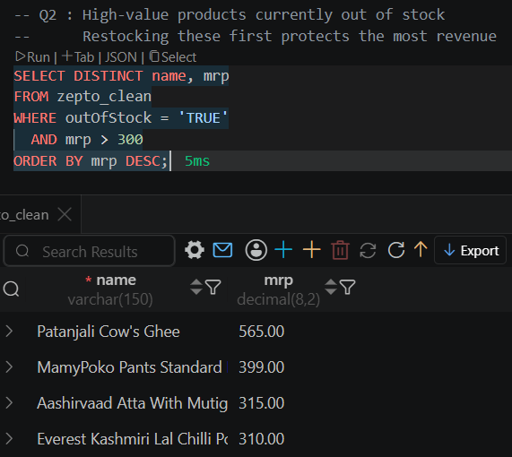
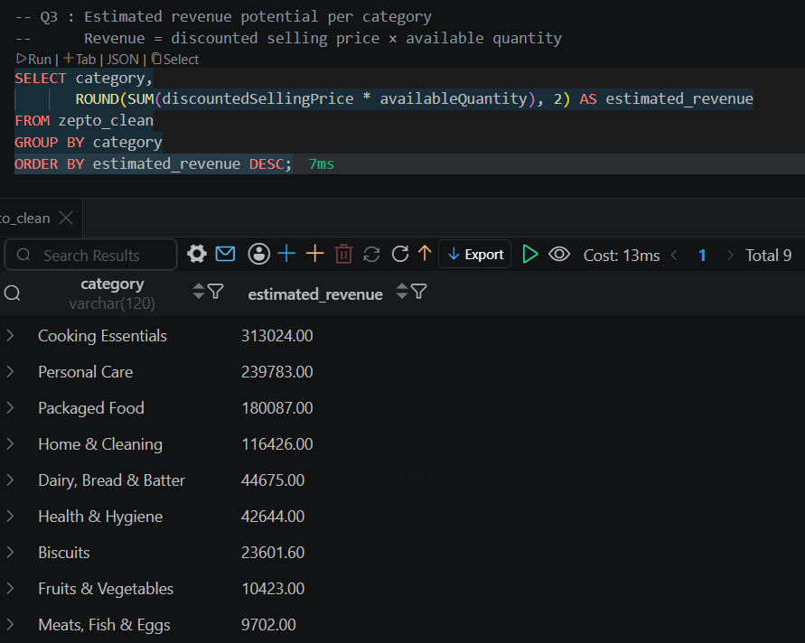
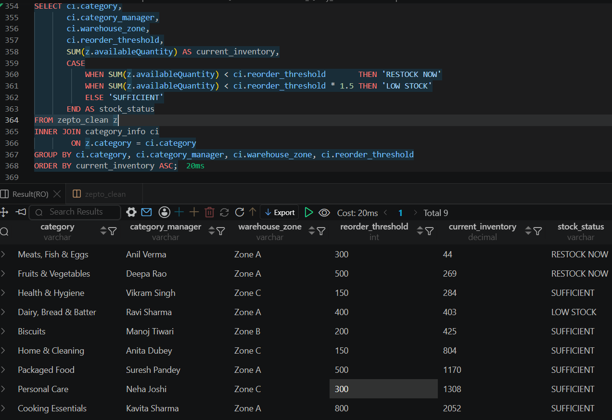

Readme · MD
# 🛒 Zepto Inventory Analysis | SQL Project
 
**Turning 3,700+ raw inventory rows into pricing, stock, and revenue decisions — using nothing but SQL.**
 
Zepto is one of India's fastest-growing quick-commerce platforms, delivering groceries in minutes. Behind every "10-min delivery" promise is an inventory system juggling thousands of SKUs, fluctuating stock, and aggressive discounting. This project digs into that inventory data to answer questions a **category manager or business analyst** would actually ask: *What's driving revenue? What's sitting out of stock? Where are we discounting too much — or too little?*
 
---
 
## 📑 Table of Contents
- [Tools Used](#-tools-used)
- [Dataset](#-dataset)
- [Project Structure](#-project-structure)
- [Schema Design](#-schema-design)
- [Project Workflow](#-project-workflow)
- [Data Cleaning & Deduplication](#-data-cleaning--deduplication)
- [Analysis Sections](#-analysis-sections)
- [Key Insights](#-key-insights)
- [Challenges Faced](#-challenges-faced)
- [How to Run This Project](#-how-to-run-this-project)
- [What's Next](#-whats-next)
- [Let's Connect](#-lets-connect)
---
 
## 🛠 Tools Used
 
| Tool | Purpose |
|---|---|
| **MySQL 8.0** | Data cleaning, schema design, querying, business logic |
| **VS Code + SQLTools** | Query development & execution environment |
 
---
 
## 📦 Dataset
 
| Detail | Value |
|---|---|
| Source | [Kaggle — Zepto Inventory Dataset](https://www.kaggle.com/datasets/palvinder2006/zepto-inventory-dataset) |
| Raw rows | 3,732 |
| Rows after removing invalid entry | 3,731 |
| Rows after deduplication | 1,675 |
| Columns | 9 |
| Key fields | `name`, `category`, `mrp`, `discountPercent`, `discountedSellingPrice`, `availableQuantity`, `weightInGms`, `outOfStock`, `quantity` |
 
---
 
## 📁 Project Structure
 
```
zepto-inventory-analysis/
│
├── zepto_db_setup.sql           # Table creation, data import, cleaning, deduplication
├── zepto_analysis.sql           # All 20 business analysis queries (4 sections)
├── sql_schema_overview.png      # Table schema & JOIN relationship
├── sql_dedup_result.png         # Before/after row count (3,731 → 1,675)
├── sql_outofstock_highmrp.png   # High-MRP out-of-stock products
├── sql_revenue_by_category.png  # Revenue ranking by category
├── sql_avg_discount_category.png # Average discount per category
├── sql_join_query_output.png    # Section 4 JOIN query result
└── README.md
```
 
> **Two-file approach:** Setup logic is cleanly separated from analysis queries — makes the project easier to review, reproduce, and extend.
 
---
 
## 🗂 Schema Design
 
Two tables power this project:
 
```sql
-- Main inventory table (deduplicated)
zepto_clean (
    name                   VARCHAR,
    category               VARCHAR,
    mrp                    DECIMAL,
    discountPercent        DECIMAL,
    discountedSellingPrice DECIMAL,
    availableQuantity      INT,
    weightInGms            DECIMAL,
    outOfStock             VARCHAR,
    quantity               INT
)
 
-- Category metadata table (enables JOIN-based analysis)
category_info (
    category               VARCHAR PRIMARY KEY,
    category_type          VARCHAR,   -- 'Perishable' / 'Non-Perishable'
    is_premium_segment     BOOLEAN,
    avg_shelf_life_days    INT
)
```
 
> `category_info` was created to enable **JOIN-based analysis** — linking inventory data with category-level metadata for richer business insights. This reflects real-world database design where business context lives in a separate dimension table.
 

 
---
 
## 🔄 Project Workflow
 
```
🔍 Explore  →  🧹 Clean  →  🏗 Schema Design  →  💡 Analyze (4 Sections)  →  📊 Insights
```
 
| Phase | What Happened |
|---|---|
| **Exploration** | Row counts, null audits, category listing, stock-status breakdown, duplicate checks |
| **Cleaning** | Removed invalid pricing rows, fixed paise→rupee conversion, corrected deduplication logic |
| **Schema Design** | Created `zepto_clean` and `category_info` tables; established JOIN relationship |
| **Analysis** | 20 queries across 4 business sections |
 
---
 
## 🧹 Data Cleaning & Deduplication
 
### Issues Found & Fixed
 
| Issue | Fix Applied |
|---|---|
| 1 row with `mrp = 0` (junk entry) | Deleted |
| Prices stored in **paise**, not rupees | Divided `mrp` & `discountedSellingPrice` by 100 |
| `outOfStock` rejected as boolean by MySQL | Imported as `VARCHAR`, filtered with `= 'true'` |
| 1,187 products duplicated across multiple category tags | Deduplicated using `ROW_NUMBER()` window function |
 
```sql
-- Convert paise → rupees
UPDATE zepto1
SET mrp = mrp / 100.0,
    discountedSellingPrice = discountedSellingPrice / 100.0;
 
-- Corrected deduplication — one row per product
CREATE TABLE zepto_clean AS
SELECT *
FROM (
    SELECT *,
           ROW_NUMBER() OVER (
               PARTITION BY name
               ORDER BY category
           ) AS rn
    FROM zepto1
) ranked
WHERE rn = 1;
```
 
### The Duplicate Investigation — How It Was Caught
 
Early revenue queries returned **suspiciously identical totals** across unrelated categories (Packaged Food, Ice Cream & Desserts, and Chocolates & Candies all showed the same number). Rather than accepting the results, I wrote diagnostic queries:
 
```sql
-- Identify products tagged under multiple categories
SELECT name, COUNT(DISTINCT category) AS category_count
FROM zepto1
GROUP BY name
HAVING category_count > 1
ORDER BY category_count DESC;
```
 
This revealed the root cause: **1,187 products were duplicated across multiple category labels** in the source data — adding 2,056 extra rows to the dataset. After deduplication, the dataset reduced from **3,731 → 1,675 rows**, and all revenue and discount figures were recalculated for accuracy.
 
> 💡 This is the kind of data quality bug that goes unnoticed when analysts trust their output without questioning it. Catching it required understanding *why* results looked wrong — not just that they did.
 

 
---
 
## 💡 Analysis Sections
 
The 20 queries in `zepto_analysis.sql` are organized into 4 sections:
 
---
 
### 📌 Section 1 — Data Exploration (5 Queries)
 
Initial scan of the dataset before any analysis begins.
 
```sql
-- Stock status breakdown
SELECT outOfStock, COUNT(*) AS product_count
FROM zepto_clean
GROUP BY outOfStock;
 
-- Distinct categories after deduplication
SELECT DISTINCT category FROM zepto_clean ORDER BY category;
```
 
---
 
### 📌 Section 2 — Pricing & Discount Analysis (5 Queries)
 
<details>
<summary><b>Q1. Which products offer the highest discounts?</b></summary>
```sql
SELECT DISTINCT name, mrp, discountPercent
FROM zepto_clean
ORDER BY discountPercent DESC
LIMIT 10;
```
**Finding:** Biscuit/wafer brands (Dukes Waffy) and ready-to-cook kits (Ceres Foods) dominate the top 10 — all at 50–51% off.
</details>
<details>
<summary><b>Q2. Where is the platform under-discounting on premium items?</b></summary>
```sql
SELECT DISTINCT name, mrp, discountPercent
FROM zepto_clean
WHERE mrp > 500 AND discountPercent < 10
ORDER BY mrp DESC;
```
**Finding:** A clear segment of premium-priced SKUs (MRP > ₹500) carries minimal discounting — likely positioned as non-promotional everyday essentials.
</details>
<details>
<summary><b>Q3. Which categories discount the most, on average?</b></summary>
```sql
SELECT category, ROUND(AVG(discountPercent), 2) AS avg_discount
FROM zepto_clean
GROUP BY category
ORDER BY avg_discount DESC
LIMIT 5;
```
**Finding:** Fruits & Vegetables (15.93%) and Meats, Fish & Eggs (9.91%) lead — perishables get discounted hardest to clear stock before spoilage.
</details>

 
---
 
### 📌 Section 3 — Stock & Revenue Analysis (5 Queries)
 
<details>
<summary><b>Q4. Which high-value products are out of stock?</b></summary>
```sql
SELECT DISTINCT name, outOfStock, mrp
FROM zepto_clean
WHERE outOfStock = 'true' AND mrp > 300
ORDER BY mrp DESC;
```
**Finding:** Patanjali Cow's Ghee (₹565), MamyPoko Pants (₹399), Aashirvaad Atta (₹315) — daily essentials, not impulse buys — were all out of stock. These are the SKUs that *shouldn't* go unavailable.
</details>

 
<details>
<summary><b>Q5. Which categories generate the most estimated revenue?</b></summary>
```sql
SELECT category,
       SUM(discountedSellingPrice * availableQuantity) AS total_revenue
FROM zepto_clean
GROUP BY category
ORDER BY total_revenue DESC;
```
**Finding:** Cooking Essentials leads at ₹2,83,472 — nearly **27x** the revenue of Fruits & Vegetables (₹10,378). Packaged goods dominate.
</details>

 
<details>
<summary><b>Q6. Best price-per-gram value products?</b></summary>
```sql
SELECT DISTINCT name, weightInGms, discountedSellingPrice,
       ROUND(discountedSellingPrice / weightInGms, 2) AS price_per_gram
FROM zepto_clean
WHERE weightInGms >= 100
ORDER BY price_per_gram;
```
**Finding:** Surfaces the true value-for-money leaders — a foundation for "Best Value" badge or filter logic.
</details>
---
 
### 📌 Section 4 — JOIN-Based Analysis with category_info (5 Queries)
 
This section uses `category_info` — a dimension table created specifically to enable JOIN-based analysis linking inventory data with category metadata.
 
<details>
<summary><b>Q7. Revenue breakdown by category type (Perishable vs Non-Perishable)?</b></summary>
```sql
SELECT ci.category_type,
       SUM(z.discountedSellingPrice * z.availableQuantity) AS total_revenue,
       ROUND(AVG(z.discountPercent), 2) AS avg_discount
FROM zepto_clean z
JOIN category_info ci ON z.category = ci.category
GROUP BY ci.category_type
ORDER BY total_revenue DESC;
```
**Finding:** Non-perishable categories dominate revenue, while perishables carry higher average discounts — a classic inventory strategy difference.
</details>
<details>
<summary><b>Q8. Which premium-segment categories have the most out-of-stock products?</b></summary>
```sql
SELECT ci.category, ci.is_premium_segment,
       COUNT(*) AS out_of_stock_count
FROM zepto_clean z
JOIN category_info ci ON z.category = ci.category
WHERE z.outOfStock = 'true' AND ci.is_premium_segment = TRUE
GROUP BY ci.category, ci.is_premium_segment
ORDER BY out_of_stock_count DESC;
```
**Finding:** Premium-segment categories with high stockout rates represent the highest revenue risk — these need priority restocking.
</details>

 
> 📂 All 5 JOIN queries for this section — including discount efficiency by shelf life and stock risk by premium segment — are available in `zepto_analysis.sql` under Section 4.
 
---
 
## 🔑 Key Insights
 
> 🏆 **Cooking Essentials** is Zepto's revenue powerhouse at an estimated **₹2,83,472** — nearly 27x the revenue of Fruits & Vegetables.
 
> 🥦 **Perishables get discounted hardest.** Fruits & Vegetables (15.93% avg) and Meats, Fish & Eggs (9.91% avg) top the discount charts — a classic "sell it before it spoils" pricing strategy.
 
> 📉 **Stockouts are hitting high-value staples.** Ghee, atta, and chilli powder — daily essentials — were found out of stock at premium price points, a likely source of significant lost revenue.
 
> 🔍 **Caught and fixed a critical data quality bug.** Identical revenue totals across unrelated categories revealed 1,187 products duplicated across multiple category tags — adding 2,056 excess rows. After correcting the deduplication logic, the dataset reduced from 3,731 → 1,675 rows and all figures were recalculated.
 
> 🗂 **JOIN-based analysis added real depth.** Creating a `category_info` dimension table and writing JOIN queries enabled business context (perishable vs non-perishable, premium segmentation) that single-table queries couldn't provide.
 
---
 
## 🧩 Challenges Faced
 
**Boolean import error:** MySQL rejected `outOfStock` as a true boolean during CSV import.
**Fix:** Imported as `VARCHAR`, used string-based filtering (`= 'true'`) — kept analysis moving without data loss.
 
**Hidden duplicate-category bug:** Early revenue queries returned identical totals across unrelated categories. Traced it back to 1,187 duplicate-tagged products — required writing diagnostic queries before trusting any output. A reminder that surprising SQL results are almost always a data signal, not a fluke.
 
**Deduplication logic correction:** Initial `ROW_NUMBER()` partitioning had an error that needed to be corrected to ensure exactly one row per product was retained, and all downstream queries were rerun after the fix.
 
---
 
## ▶️ How to Run This Project
 
**Step 1 — Clone the repo (terminal/bash)**
```bash
git clone https://github.com/SunainaSingh56/zepto-inventory-analysis.git
```
 
**Step 2 — Set up the database (MySQL client)**
```sql
CREATE DATABASE zepto_db;
USE zepto_db;
```
 
**Step 3 — Run setup file first** (creates tables, imports data, cleans & deduplicates)
```sql
SOURCE zepto_db_setup.sql;
```
 
**Step 4 — Run analysis file** (all 20 queries across 4 sections)
```sql
SOURCE zepto_analysis.sql;
```
 
> Requires: MySQL 8.0+, VS Code with SQLTools extension (or any MySQL client)
 
---
 
## 🚀 What's Next
 
- [ ] Build a Power BI dashboard on top of `zepto_clean` findings
- [ ] Expand `category_info` with real shelf-life and margin data for deeper JOIN analysis
- [ ] Automate the cleaning + deduplication into a stored procedure
---
 
## 🤝 Let's Connect
 
📌 **GitHub:** [SunainaSingh56](https://github.com/SunainaSingh56)
📌 **LinkedIn:** [Sunaina Singh](https://www.linkedin.com/in/sunainasingh56)
 
*If you found this useful, a ⭐ on the repo goes a long way!*
 
